<h1 align="center">
  
</h1>

  <a href="https://skillicons.dev">
    <!-- Customize these skills as needed -->
    
  </a>

## 📊 GitHub Analytics

  
  

## 🐍 Contribution Graph

  <!-- This image is generated automatically by the Snake Action below -->
  

## 📡 Recent Activity
<!-- START_SECTION:activity -->
<!-- END_SECTION:activity -->
